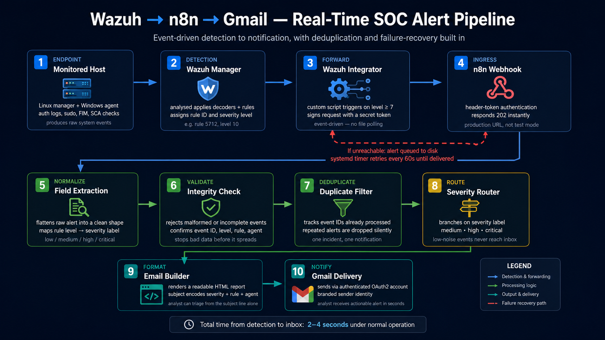
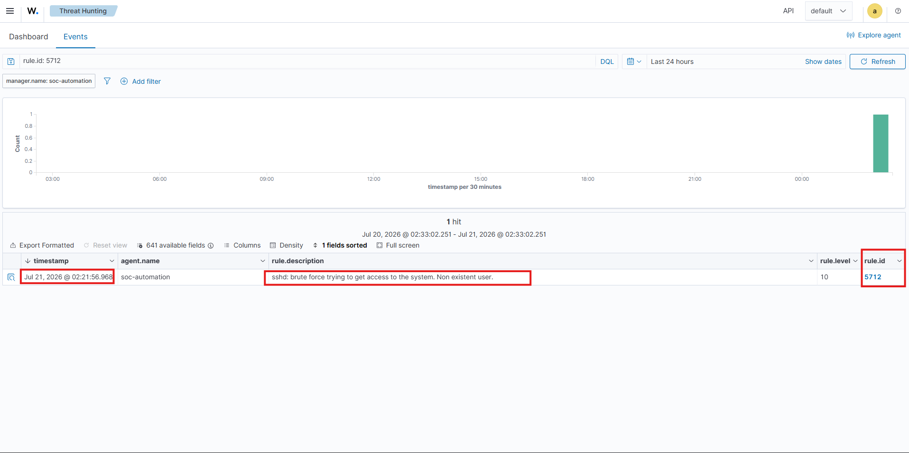
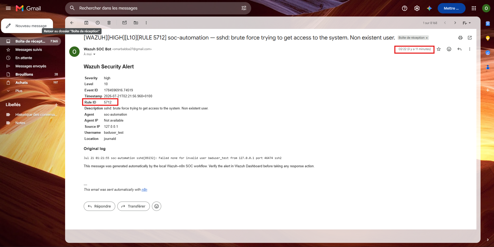
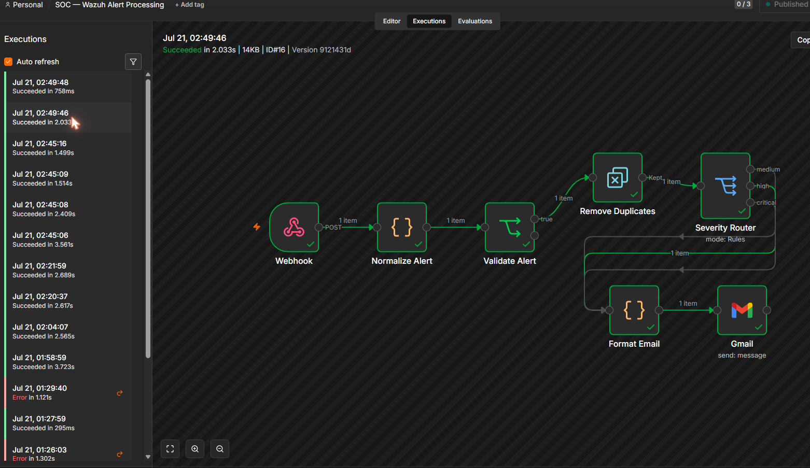
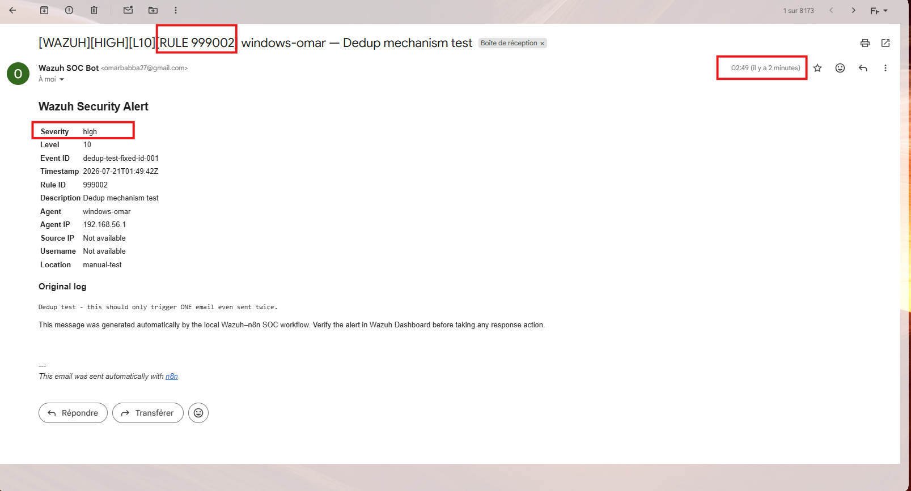
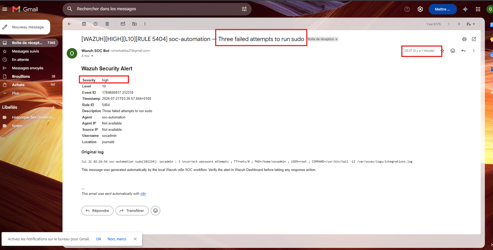
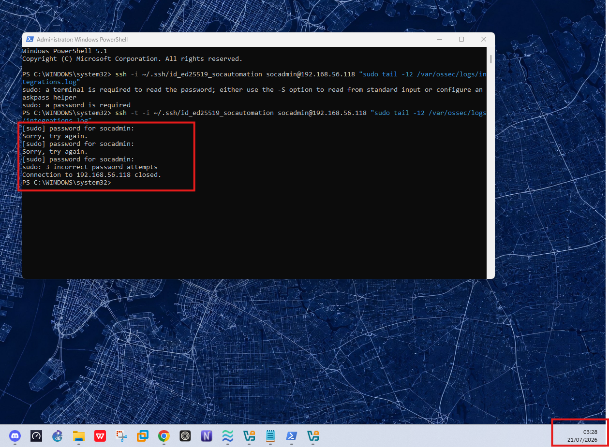
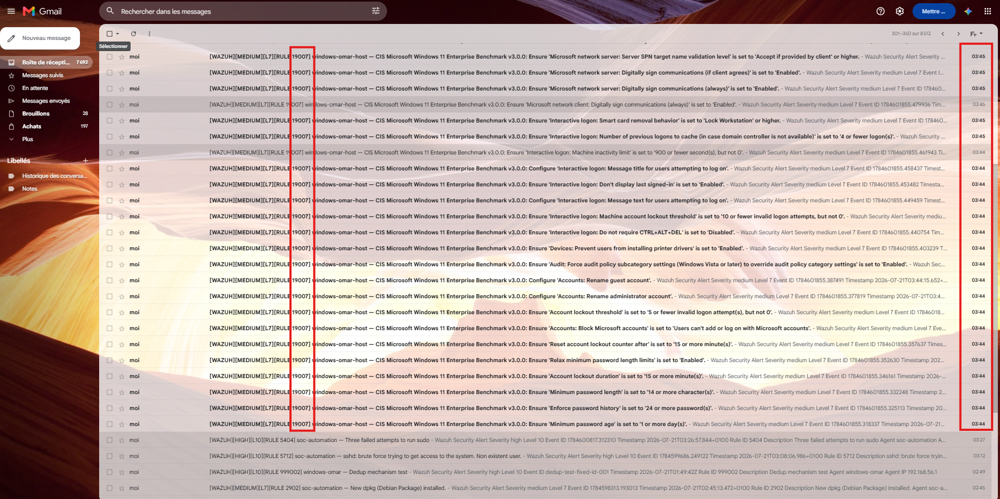
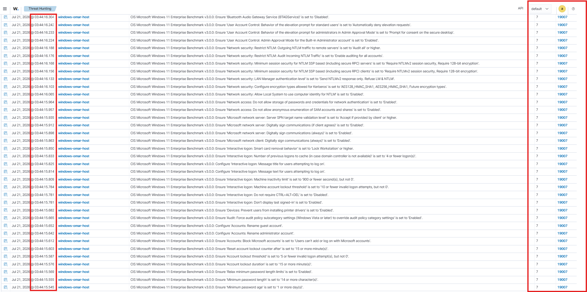

# Wazuh → n8n → Gmail: Real-Time SOC Alert Pipeline

A self-hosted security automation pipeline that turns raw Wazuh detections into severity-classified, deduplicated email alerts — built and validated end-to-end in a local SOC lab, with a real Windows endpoint generating live findings.



A walkthrough video of the diagram above, following one alert through all ten stages, is in [`assets/pipeline-walkthrough.mp4`](assets/pipeline-walkthrough.mp4).

---

## About

Most Wazuh-to-notification tutorials stop at "poll a JSON file every few seconds and forward it." This project does the opposite: it wires Wazuh's own **Integrator** module directly into an n8n workflow over an authenticated production webhook, so alerts move in real time, get validated and deduplicated before anyone sees them, and survive n8n going down without losing a single event.

It was built, broken, and fixed on real infrastructure — including a genuine Windows endpoint agent, a real brute-force detection, an accidental self-inflicted alert, and a production incident (a compliance-scan flood) that got diagnosed and resolved live. Every claim below is backed by a matched pair of screenshots: one from the Wazuh dashboard, one from the resulting email, same rule ID, same timestamp.

**Stack:** Wazuh 4.14 (manager + Windows agent) · Docker · n8n (self-hosted, pinned version) · Gmail API (OAuth2) · systemd

---

## Architecture

| Stage | Component | Responsibility |
|---|---|---|
| 1 | **Monitored host** | Linux manager + Windows endpoint agent generate raw events: auth logs, sudo activity, file integrity changes, compliance checks |
| 2 | **Wazuh Manager** | Decodes and classifies events, assigns a rule ID and severity level |
| 3 | **Wazuh Integrator** | Custom script fires on level ≥ 7, signs the request with a secret token, and posts to the webhook — event-driven, not a polling loop |
| 4 | **n8n Webhook** | Header-token authenticated ingress, responds instantly, hands off to the processing chain |
| 5 | **Normalize** | Flattens the raw alert into a consistent shape, maps rule level to a severity label |
| 6 | **Validate** | Rejects malformed or incomplete payloads before they propagate |
| 7 | **Deduplicate** | Tracks event IDs already processed; repeats are dropped silently |
| 8 | **Severity Router** | Branches on severity — low-noise events never reach an inbox |
| 9 | **Format** | Builds an HTML report; the subject line alone is enough to triage |
| 10 | **Gmail Delivery** | Sends via an authenticated OAuth2 account under a dedicated sender identity |

If the webhook is unreachable at step 4, the alert is written to a local disk queue instead of being dropped. A systemd timer retries every 60 seconds and drains the queue automatically the moment n8n comes back — this was tested by killing n8n mid-flight and confirming automatic recovery.

---

## Test Cases

Each case below pairs the Wazuh-side detection with the resulting notification — same rule ID, same timestamp, proving the pipeline end to end rather than a mocked demo.

### Case 1 — Real brute-force detection

A live SSH brute-force attempt against a non-existent user was detected natively by Wazuh (rule 5712, level 10) and forwarded automatically, with no manual intervention.

<table>
<tr>
<td></td>
<td></td>
</tr>
<tr><td align="center">Wazuh dashboard — rule 5712</td><td align="center">Resulting alert email</td></tr>
</table>

### Case 2 — Deduplication verified

The same event ID was submitted twice in a row. The first execution ran the full chain to Gmail; the second was cleanly filtered at the deduplication step and never reached the inbox — one incident, one notification.

<table>
<tr>
<td></td>
<td></td>
</tr>
<tr><td align="center">n8n execution — full chain, first run</td><td align="center">Single resulting email</td></tr>
</table>

### Case 3 — An accidental, fully organic alert

While debugging an SSH key permission issue, three consecutive `sudo` password typos triggered a genuine Wazuh detection (rule 5404, "Three failed attempts to run sudo") with zero staging. It reached the inbox in real time.

<table>
<tr>
<td></td>
<td></td>
</tr>
<tr><td align="center">Alert email — unplanned, organic trigger</td><td align="center">The terminal session that caused it</td></tr>
</table>

### Case 4 — Real Windows endpoint, and a lesson in tuning

A genuine Wazuh agent was deployed on a Windows 11 host and connected to the manager. Its built-in Security Configuration Assessment module ran a full CIS benchmark scan — 482 checks, 350 of them failing, many at level 7 and above.

Because deduplication keys on event ID and every individual check has a unique one, every failed check produced its own independent, valid alert. The pipeline behaved exactly as designed — the volume simply exposed a missing noise filter on a compliance-scan source that was never meant to page anyone. It's included here deliberately: a pipeline that never gets stress-tested by its own data hasn't really been tested.

<table>
<tr>
<td></td>
<td></td>
</tr>
<tr><td align="center">Resulting inbox volume — rule 19007</td><td align="center">Matching Wazuh dashboard events</td></tr>
</table>

---

## Lessons Learned

- **Event-driven beats polling.** Wiring the Integrator directly cut alert latency to 2–4 seconds, with no wasted cycles re-reading a log file.
- **Deduplication needs a scope, not just a key.** Keying on event ID alone is correct for genuine incidents, but a noisy source that mints a fresh ID per sub-check will bypass it entirely — the fix belongs at the source filter, not the dedup logic.
- **A downtime test is only real if you kill the service mid-flight.** Simulating queue behavior in code proves nothing; stopping the container and watching the disk queue drain automatically on restart does.
- **The best failure mode is a loud one.** The compliance-scan flood was diagnosed and root-caused within minutes because the pipeline surfaced every alert individually instead of swallowing errors silently.

---

## Getting Started

See [`docs/installation.md`](docs/installation.md) for the full setup procedure.

## Repository Structure

```
.
├── README.md
├── .env.example
├── .gitignore
├── docker/
│   └── docker-compose.yml
├── wazuh/
│   ├── custom-n8n
│   └── ossec-integration.xml.example
├── n8n/
│   └── wazuh-alert-processing.workflow.json
├── replay/
│   ├── replay-wazuh-n8n.py
│   ├── wazuh-n8n-replay.service
│   └── wazuh-n8n-replay.timer
├── docs/
│   └── installation.md
└── assets/
    ├── architecture.png
    ├── pipeline-walkthrough.mp4
    └── screenshots/
        ├── 01-wazuh-dashboard-rule5712.png
        ├── 02-gmail-alert-rule5712.png
        ├── 03-n8n-execution-dedup-1st.png
        ├── 04-gmail-dedup-test.png
        ├── 05-gmail-organic-rule5404.png
        ├── 06-terminal-sudo-3fail-trigger.png
        ├── 07-gmail-sca-flood-rule19007.png
        └── 08-wazuh-dashboard-sca-rule19007.png
```
